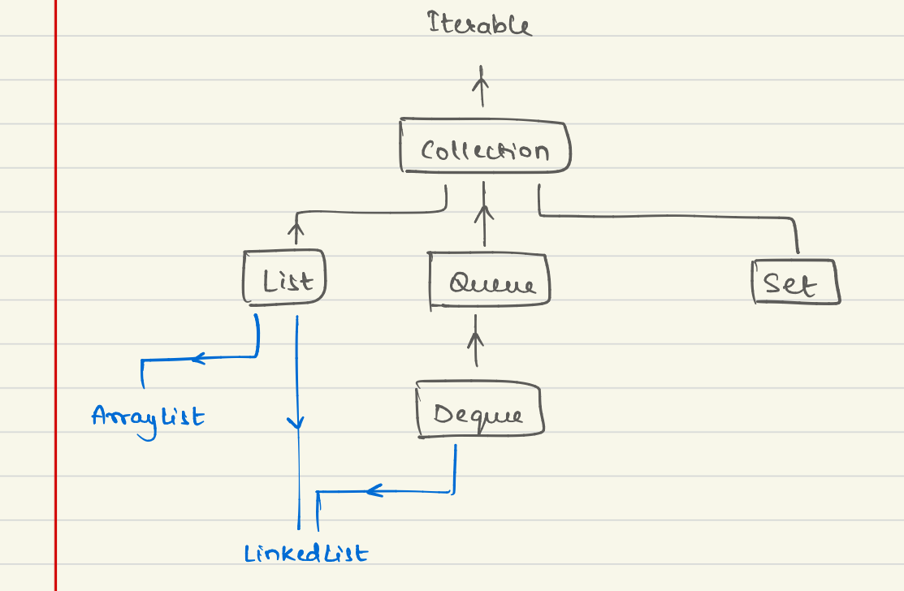

# Custom Java Collection Framework Learning Journey

Revised OOP concepts and implemented custom collection structures including ArrayList and LinkedList.

## Concepts Added

- Revised core OOP concepts
- Implemented custom:
    - Collection → List → ArrayList
    - Collection → List → LinkedList
    - Collection → Queue → Deque → LinkedList
- Explored generics and type-safe design
- Learned inner classes and iterator implementation
- Practiced Iterable and Iterator usage
- Understood:
    - Collection → List hierarchy
    - Collection → Queue → Deque hierarchy
- Implemented interface-based collection design
- Learned Comparable and Comparator concepts
- Practiced:
    - compareTo()
    - compare(obj1, obj2)

  

## Current Focus

- Revising LinkedList LeetCode questions
- Strengthening pointer and traversal understanding

## Next Focus

- Implement ArrayDeque
- Understand real importance of Stack and Queue through LeetCode problems
- Improve edge-case handling and data structure design